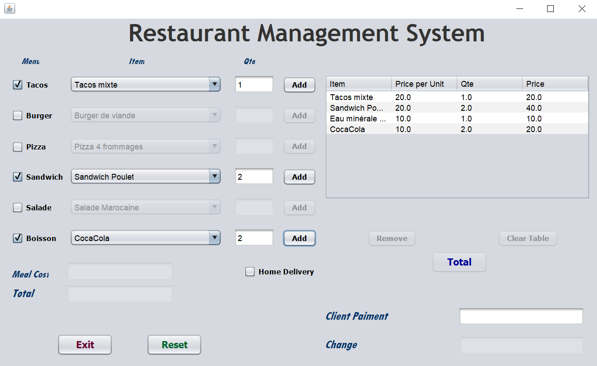

# Restaurant-Management-System
A Java Based Desktop Application for Registring &amp; managing sales and bills built for a restaurant in my hometown.

<!-- LOGO -->
 

  

<!-- TABLE OF CONTENTS -->
## Table of Contents

* [About the Project](#about-the-project)
* [Built With](#built-with)
* [Contact](#contact)

<!-- ABOUT THE PROJECT -->
## About The Project
A Java Based Desktop Application for Registring &amp; managing sales and bills built for a restaurant in my hometown..

    
  </a>

## Built With
Java
 
jFrame
 
NetBeans

<!-- CONTACT -->
## Contact

SALHAOUI Mohamed - med.salhaoui97@gmail.com

Project Link: [https://github.com/med-S/Gestion-des-stagiaires/](https://github.com/med-S/Gestion-des-stagiaires/)

